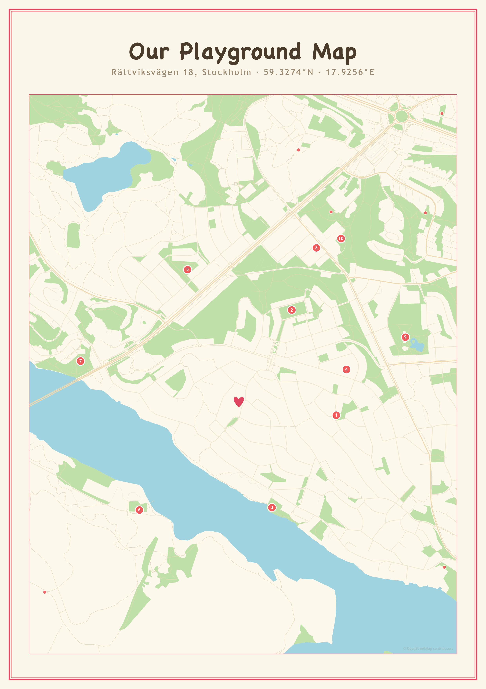
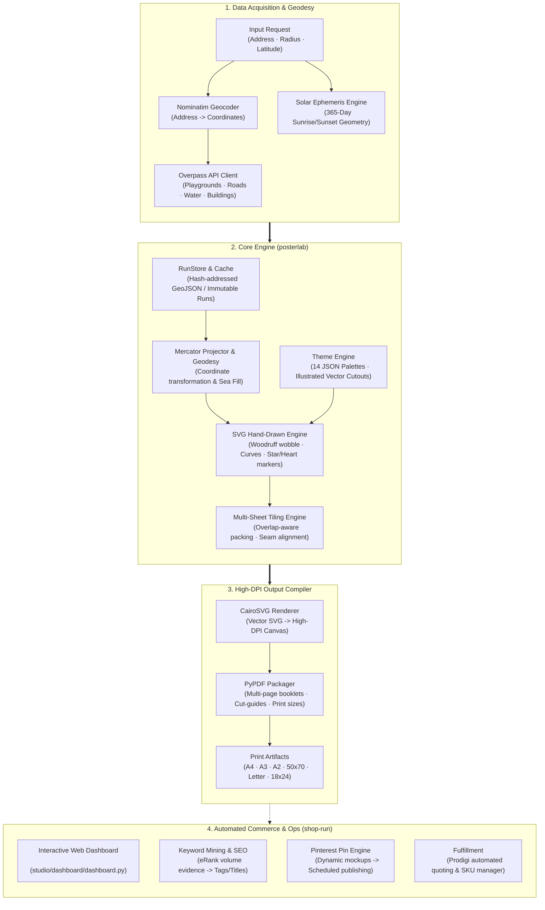
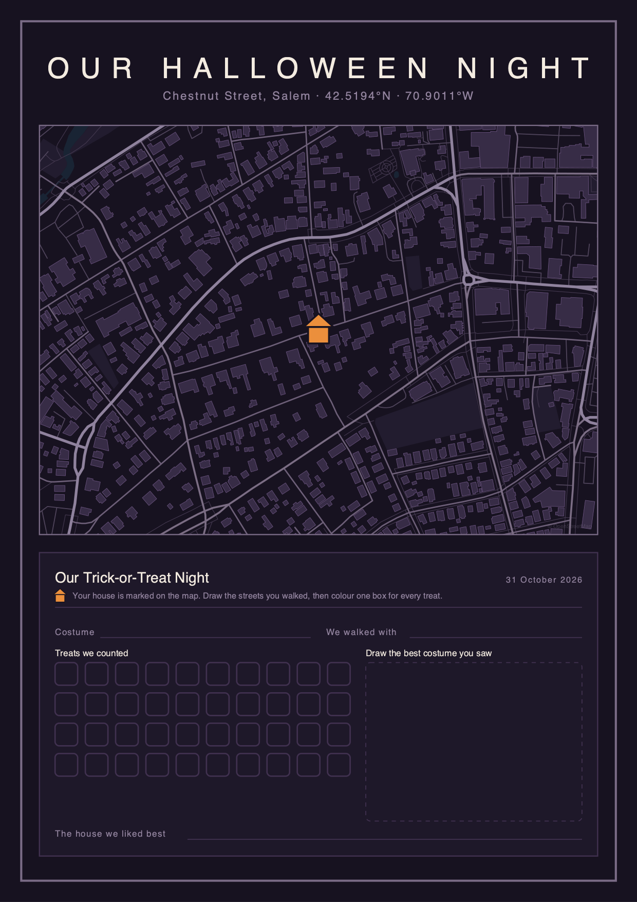
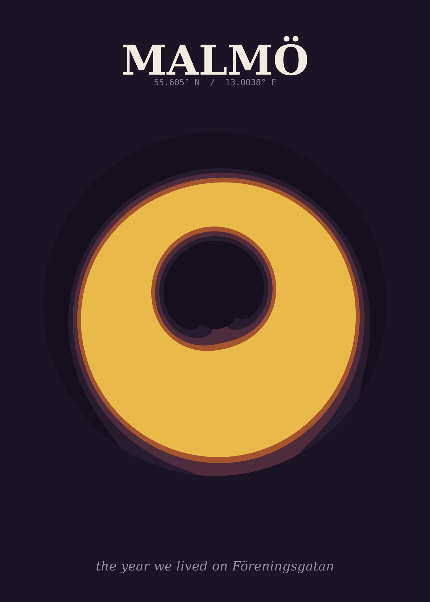
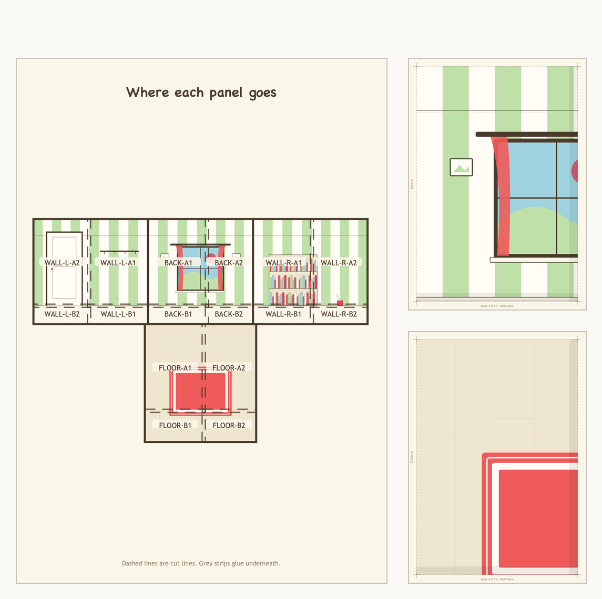

# Poster Studio Engine 🗺️🎨☀️

> **Deterministic data-to-art Python pipeline converting OpenStreetMap and astronomical data into print-ready, high-DPI poster products sold on Etsy and print-on-demand networks.**

[](https://www.python.org/downloads/release/python-3120/)
[](#testing)
[](https://hopscotchmaps.etsy.com)
[](#licensing)

---

## Featured Sample: Playground Map (FAM-001)

An example of a print-ready, high-DPI (300+ DPI) personalized vector map generated from OpenStreetMap data for Bromma, Stockholm (`"Rättviksvägen 18, 167 75 Bromma"`, 1000m radius):

<div align="center">
  
  <p><em>Rendered with the <strong>Whimsy</strong> theme in <strong>A2 clean portrait</strong> format. Local playgrounds are numbered, parks/green spaces are styled, and water bodies are geometrically clipped with hand-drawn SVG borders.</em></p>
</div>

---

## Overview

**Poster Studio Engine** is an automated, end-to-end multi-poster production studio. It pairs geospatial data extraction (OpenStreetMap Overpass API) and solar ephemeris calculations with a vector rendering engine to generate publication-grade, print-ready posters (≥300 DPI vector PDFs and raster previews).

Beyond poster rendering, the repository includes a complete **e-commerce automation suite** (`shop-run`) that manages keyword research (eRank), listing asset generation, Pinterest pin scheduling, and print-on-demand fulfillment (Prodigi).

---

## 1. System Architecture



---

## 2. Product Showcase

The studio powers four distinct, production-tested poster families:

| Product Code | Name | Description | Key Sample |
|---|---|---|---|
| **FAM-001** | **Playground Map** | Keepsake map turning local neighborhood parks into an annotated family adventure poster. | **Bromma, Stockholm** (`Rättviksvägen 18, 167 75 Bromma`, $r=1000\text{m}$) |
| **FAM-002** | **Halloween Night** | Print-at-home trick-or-treat keepsake map and spotting log within 300–400m of home. | **Salem, Massachusetts** (`Chestnut Street, Salem, USA`, $r=300\text{m}$) |
| **FAM-003** | **Shelf Room Playscape** | Multi-sheet room inserts designed to turn standard 33x33cm cube shelves (e.g. IKEA Kallax) into figure play rooms. | **Whimsy Nursery Cube** (11 A4 tiled sheets, 10mm overlap) |
| **PRT-006** | **Sun-Year Poster** | Minimalist astronomical artwork plotting 365 days of daylight rings for any global latitude. | **Solar Rings** (Kiruna 67.8°N · Stockholm 59.3°N · Istanbul 41.0°N · Cairo 30.0°N) |

<div align="center">
  
  &nbsp;&nbsp;&nbsp;&nbsp;
  
  <p><em>Left: <strong>FAM-002 Halloween Night Sheet</strong> (Salem, MA) · Right: <strong>PRT-006 Sun Year Poster</strong> (Filled Ring 1B).</em></p>
</div>

---

## 3. Key Architectural Highlights

### 📐 Multi-Sheet Overlap Tiling Engine (`posterlab/chrome/tiling.py`)

When printing physical objects larger than standard home paper (such as a 330×330×390 mm cube shelf diorama), the surface must be partitioned across multiple A4 or US Letter sheets. The **Multi-Sheet Overlap Tiling Engine** provides mathematically optimized bin-packing and parent-friendly assembly:

<div align="center">
  
  <p><em><strong>Left:</strong> Page 2 Unfolded 3D Assembly Net with mapped panel IDs (<code>BACK-A1</code>, <code>WALL-L-A1</code>, <code>FLOOR-A1</code>, etc.) · <strong>Right:</strong> Individual A4 print sheets featuring 10mm tinted overlap tabs, dashed cut guidelines, registration crosshairs, and margin identifiers.</em></p>
</div>

#### How the Tiling Engine Works:
1. **Seam-Aware Artwork Generation:** Surface coordinates and split lines are computed *before* rendering so that the artwork places real visual features (e.g., baseboards, dado rails, wallpaper seams) along the physical joints.
2. **Deterministic 10 mm Overlap Flaps:** Every internal cut includes an automatic 10 mm tinted flap for under-gluing, ensuring no unprinted gaps appear during manual cutting.
3. **No L-Shaped Cuts (Kitchen-Table Rule):** Panels stack strictly vertically down each sheet, guaranteeing every cut line runs straight across the page.
4. **First-Fit Decreasing Packing:** Packs irregular offcuts to drop total paper requirements from 16 naive sheets down to 11 sheets (**87% printable area efficiency**).
5. **Print Calibration Guard:** Generates a 50 mm calibration test square on Page 1 to verify printer 100% scale before cutting.

---

### 📍 Standalone OpenStreetMap Overpass Engine
- **Decoupled Fetch & Render:** Geocoding and Overpass queries are cached immutably in `data/runs/<kind>/<run_id>/`. Re-rendering themes or sizes uses **zero network calls**.
- **Offline Resilience:** Includes pre-packaged offline sample datasets (`data/sample_bromma_playgrounds.geojson`) for testing and instant rendering in air-gapped environments.
- **Water & Coastline Clipping:** `posterlab/geo/sea_fill.py` automatically clips land/water boundaries to prevent mainland artifacts.

---

### 🤖 Autonomous E-Commerce Operations (`shop-run`)
- Executes scheduled shop maintenance sessions via background launchd/cron jobs.
- Scrapes eRank keyword data to back Etsy tags and titles with verified search volume.
- Builds high-converting Pinterest pins and manages social publishing queues.
- Synchronizes metrics into telemetry logs (`studio/brand/metrics.csv` and `shop-log.md`).

---

## 4. Quickstart Guide

### Prerequisites
- Python 3.12
- [`uv`](https://docs.astral.sh/uv/) package manager
- `cairo` system library (e.g. `brew install cairo` on macOS, `apt install libcairo2` on Ubuntu)

### Installation
```bash
# Clone the repository
git clone https://github.com/mfdel/poster-studio-engine.git
cd poster-studio-engine

# Create virtual environment and install dependencies
uv venv --python 3.12 && source .venv/bin/activate
uv pip install -e ".[dev]"
```

### 1. Render the Bromma Playground Map (FAM-001)
```bash
# Generate from live OpenStreetMap data (or cached hit)
uv run python posters/fam001-playground-map/make.py \
    --address "Rättviksvägen 18, 167 75 Bromma" \
    --radius 1000 \
    --theme whimsy \
    --size A2 \
    --title "Our Playground Map" \
    --preview

# Re-render cached run without network calls
uv run python posters/fam001-playground-map/render.py --run latest --theme whimsy --size A2
```

### 2. Generate FAM-003 Shelf Room Tiled Pack
```bash
# Generate 330mm cube room sheets packed onto A4 with assembly preview
uv run python posters/fam003-shelf-room/make.py --cube 330 --pack A4 --preview
```

### 3. Render PRT-006 Sun Year Astronomical Calendar
```bash
# Render solar ring for Stockholm
uv run python posters/prt006-sun-year/render_1b.py \
    --lat 59.327 \
    --city "Stockholm" \
    --year 2026
```

### 4. Launch Interactive Web Dashboard
```bash
# Open the local web control panel in your browser
uv run python studio/dashboard/dashboard.py --open
```

---

## 5. Testing

The test suite validates vector math, POD dimensions, seam alignments, and multi-sheet packing algorithms:

```bash
uv run pytest
```

```
============================== test session starts ==============================
collected 70 items

tests/test_digital_pack.py .........                                      [ 12%]
tests/test_pod_sizes.py ..........                                        [ 27%]
tests/test_room_seams.py .............                                    [ 45%]
tests/test_tiling.py ......................................               [100%]

============================== 70 passed in 10.45s ==============================
```

---

## 6. Licensing & Attribution

- **Code:** Licensed under the MIT License.
- **Geographical Data:** OpenStreetMap data is licensed under the **Open Data Commons Open Database License (ODbL)** by the OpenStreetMap Foundation (OSMF). All generated map posters display compliant attribution: `© OpenStreetMap contributors`.
